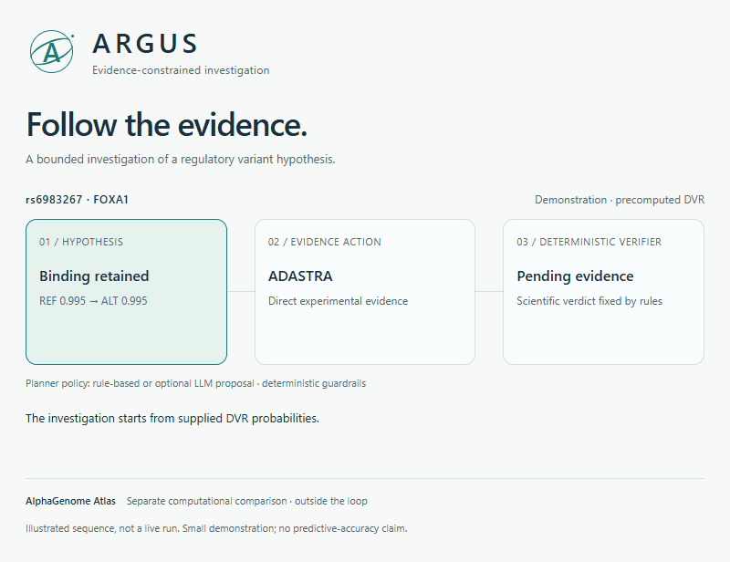

  

<h1 align="center">ARGUS</h1>

  <strong>Evidence-constrained agentic reasoning for noncoding regulatory variant interpretation.</strong>

  
  
  

  <a href="#illustrated-investigation">Demo</a> ·
  <a href="docs/architecture.md">Architecture</a> ·
  <a href="docs/data_setup.md">Data setup</a> ·
  <a href="#current-limitations">Limitations</a> ·
  <a href="CITATION.cff">Citation</a>

---

## Overview

ARGUS is a research framework with two connected stages: the existing DVR pipeline/notebook predicts transcription-factor (TF) binding probabilities for reference and alternate alleles, and the ARGUS investigation stage treats a DVR prediction as a hypothesis for bounded evidence investigation.

The notebook/DVR stage and investigation runner are not yet fully integrated end-to-end from one natural-language prompt. Some runs use supplied or precomputed DVR probabilities. The current evaluation is a small demonstration, not a predictive-accuracy benchmark.

## Illustrated investigation

  

  <em>A 22-second illustration of the demonstrated investigation behavior, using precomputed DVR predictions. This is not a live run or a predictive-accuracy benchmark.</em>

  <a href="docs/media/argus-demo-poster.png">View a still image</a> ·
  <a href="docs/media/argus-demo.html">Interactive version (download and open locally)</a> ·
  <a href="docs/media/argus-symbol.svg">ARGUS symbol</a>

**Two outcomes, one evidence standard.** In the illustrated FOXA1 case, admissible direct experimental evidence contradicts the DVR prediction and the investigation status is `rescued`. For KLF6, motif evidence opposes DVR and regulatory context is non-resolving, so ARGUS abstains. The planner cannot override the deterministic verifier, and the reporter narrates fixed facts.

## Evaluated architecture

*The figure depicts the evaluated loop using precomputed DVR predictions. AlphaGenome Atlas remains a separate computational comparison outside the loop. The FOXA1 and KLF6 cases illustrate evidence handling in the demonstration, not general predictive performance.*

## Implemented capabilities

| Component | Implemented role and boundary |
| --- | --- |
| DVR prediction | The existing pipeline/notebook takes a variant query and produces reference- and alternate-allele TF binding probabilities. |
| Bounded investigation | Accepts a DVR prediction as a hypothesis and investigates it using ADASTRA, JASPAR, and ENCODE cCRE. |
| Rule-based planner | Uses a deterministic policy to select evidence actions or abstain. |
| Optional Anthropic planner | Proposes only allowed evidence actions or abstention, validated by deterministic guardrails. It cannot change the verifier or scientific verdict. |
| Deterministic verifier and stopping rules | Interpret observations, assign evidence states, and allow abstention when evidence does not resolve the hypothesis. |
| Anthropic reporter | Generates prose from fixed structured facts. It cannot override deterministic classifications or claim experimental confirmation without direct evidence. |
| AlphaGenome Atlas comparison | Tested as a standalone computational cross-reference; not integrated into the loop. |

## Evidence rules

| Source | Evidence role | Interpretation boundary |
| --- | --- | --- |
| ADASTRA | Direct experimental allele-specific TF binding evidence | Strong terminal decisions require admissible direct experimental evidence; a lookup alone does not establish a verdict. |
| JASPAR | Computational allele-specific motif evidence | Indirect evidence; cannot independently establish TF binding. |
| ENCODE cCRE | Regulatory-element context | Indirect evidence; cannot independently establish TF binding or resolve binding direction. |

Strong terminal decisions such as `supported`, `contradicted`, and `rescued` require admissible direct experimental evidence. Evidence that is unavailable, underpowered, contextual only, or mixed can lead to abstention. Regulatory context does not turn motif evidence into experimental confirmation.

For the KLF6 case in the figure: **Motif evidence opposes DVR; regulatory context is non-resolving.** For FOXA1, the figure distinguishes an evidence verdict that contradicts the DVR prediction from the investigation status `rescued`.

## Current limitations

- DVR prediction and investigation are not yet fully integrated from one natural-language prompt.
- Some investigation runs begin with supplied/precomputed DVR probabilities; the figure shows this evaluated entry point.
- AlphaGenome Atlas is a separate computational comparison and does not contribute loop evidence or verdicts.
- The evaluation demonstrates investigation behavior on a small set of examples. It does not establish predictive accuracy or general performance.

The documented scope is research interpretation of predictions and evidence. No autonomous-discovery, clinical-use, or predictive-accuracy claims are made.

## Repository guide

- [Architecture](docs/architecture.md): stage boundaries, planner policies, evidence rules, and reporting.
- [Data setup](docs/data_setup.md): local resources, prediction provenance, and configuration.
- [Examples](examples/README.md): interpretation of the illustrated demonstration and requirements for runnable examples.
- [Results](results/README.md): evaluation scope and local artifact guidance.
- [Environment template](.env.example): proposed local settings, pending alignment with source.
- [Citation metadata](CITATION.cff): provisional project citation.

This checkout currently contains documentation, templates, the architecture figure, and illustrative media. The capabilities above follow the maintainer's project summary; source, dependencies, and runnable entry points are not present here for independent code verification. Installation and execution commands remain to be documented from the source.

## Local setup and contributions

Read the architecture and data setup documents first. If useful for local planning, copy `.env.example` to `.env`; its variable names are proposed, and no environment loader is supplied in this checkout. Anthropic is used by the optional planner and by the prose reporter.

Keep API keys, model weights, knowledgebase databases, large results, and user-specific server paths out of version control. Ignore rules cover common artifacts and local resource directories but do not remove already tracked files.

Use the GitHub issue and pull request templates to describe changes, their effect on evidence interpretation, and the checks performed.

## Citation and licensing

See [CITATION.cff](CITATION.cff). Contributor attribution is provisional. The maintainer should supply author names, repository URL, release version, and any publication identifier before formal release.

No license has been selected in this repository. Resource-specific access and redistribution terms must be checked separately.
