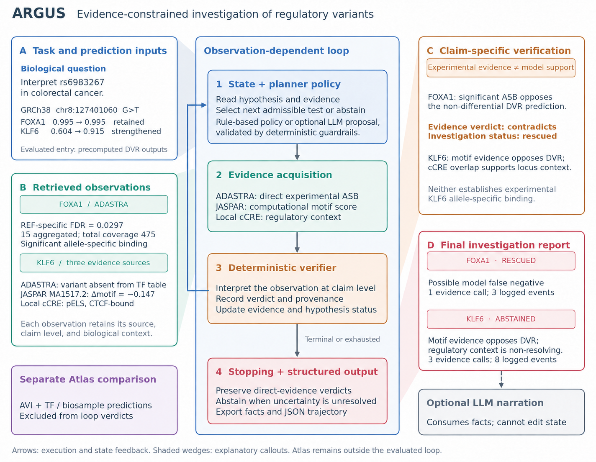

<p align="center">
  
</p>

<h1 align="center">ARGUS</h1>

<p align="center">
  <b>Evidence-Constrained Agentic Reasoning for Noncoding Regulatory Variant Interpretation</b>
</p>

<p align="center">
  <!-- <a href="https://arxiv.org/abs/XXXX.XXXXX"></a> -->
  <a href="https://huggingface.co/duttaprat/DeepVRegulome"></a>
  <a href="#license"></a>
  <a href="https://www.python.org/downloads/"></a>
  <a href="#citation"></a>
</p>

<p align="center">
  <a href="#overview">Overview</a> •
  <a href="#code-availability">Code availability</a> •
  <a href="#architecture">Architecture</a> •
  <a href="#results">Results</a> •
  <a href="#citation">Citation</a>
</p>

---

## Overview

ARGUS (**A**gentic **R**egulatory **G**enomics for an **U**ncertainty-aware **S**cientist) is a closed-loop agentic framework for interpreting noncoding regulatory variant predictions. Named after Argus Panoptes, the hundred-eyed giant of Greek mythology who watched from every angle simultaneously, ARGUS examines variant predictions through multiple independent evidence sources before forming a verdict.

**The core principle: DVR predicts, ARGUS investigates whether to believe the prediction.**

ARGUS wraps [DeepVRegulome](https://github.com/DavuluriLab/DeepVRegulome)'s 458 DNABERT-based TF binding models in a hypothesis-directed investigation loop where:

- A **deterministic classifier** assigns every biological label, so an LLM never interprets raw model outputs
- A **planner** selects evidence sources based on current uncertainty
- A **verifier** deterministically interprets each observation
- **Intermediate results change the investigation path**
- An LLM is used only for optional constrained planning and for reporting from pre-classified facts; it cannot change any classification or verdict

<p align="center">
  
</p>

## Code availability

ARGUS is under active development. Source code will be released in stages, with the full implementation released alongside the extended manuscript. This repository currently provides the documentation, architecture figure, and citation for the workshop paper.

Running ARGUS will require Python 3.11+, an Anthropic API key (for the optional LLM planner and the reporter), and local ADASTRA, JASPAR, and ENCODE cCRE resources (see [Data Setup](docs/data_setup.md)).

## Architecture

ARGUS consists of five modules with strictly separated responsibilities:

| Module | Role | LLM involved? |
|--------|------|:--------------:|
| `state.py` | Hypothesis state, evidence ledger, trajectory | No |
| `planner.py` | Select next evidence test based on uncertainty | Fixed: No / LLM: Yes (constrained) |
| `verifier.py` | Interpret raw tool output as typed verdict | No |
| `stopping.py` | Assign terminal status when planner abstains | No |
| `reporter.py` | Generate narrative from pre-classified facts | Yes (constrained) |

### Evidence hierarchy

Evidence sources are typed and ranked. The verifier and stopping rule enforce these boundaries:

| Source | Type | Can establish |
|--------|------|--------------|
| ADASTRA | Experimental, direct | Supported, contradicted, rescued |
| JASPAR | Computational, TF-specific | Partial support or opposition |
| ENCODE cCRE | Contextual only | Cannot support any TF-specific claim |

Strong terminal decisions (`supported`, `contradicted`, `rescued`) require admissible direct experimental evidence. cCRE context alone cannot promote a hypothesis. Mixed indirect evidence leads to abstention.

### Investigation loop

```
DVR prediction → HypothesisState (ACTIVE)
    ↓
Planner → selects evidence tool
    ↓
Tool → returns raw observation
    ↓
Verifier → deterministic verdict + status update
    ↓
Planner → reads updated state, selects next tool or abstains
    ↺ (loop until terminal)
    ↓
Stopping rule → final status if planner abstains
    ↓
Reporter → constrained narrative from fixed facts
```

## Results

The workshop paper evaluates ARGUS on a small set of TF hypotheses at rs6983267 (8q24, colorectal cancer). It demonstrates investigation behavior; it is not a predictive-accuracy benchmark. Two illustrative trajectories:

| TF | DVR prediction | Steps | Tools used | Final status | Key observation |
|----|---------------|:-----:|-----------|:------------:|-----------------|
| FOXA1 | retained [saturated] | 3 | ADASTRA | **rescued** | Significant allele-specific binding (FDR = 0.030, 15 experiments, 475 reads); contradicts the non-differential DVR prediction |
| KLF6 | strengthened | 8 | ADASTRA → JASPAR → cCRE | **abstained** | No ADASTRA record; JASPAR motif opposes DVR (Δ = −0.147); regulatory context is non-resolving |

The same planner produces a 3-step and an 8-step trajectory because the intermediate observations differ. See the paper for the full set of cases and the fixed vs. LLM planner comparison.

## Limitations

- Evaluated on a small number of hypotheses; it demonstrates behavior, not predictive accuracy
- Decision thresholds (motif score difference, ADASTRA power filter) are heuristic and not yet calibrated
- DVR predictions are precomputed; prediction and investigation are not yet integrated end-to-end
- The fixed planner uses a priority list, not a learned policy
- Factual accuracy of the generated narrative has not been formally evaluated
- AlphaGenome Atlas was used only as a standalone computational cross-reference, outside the loop

## Citation

```bibtex
@inproceedings{
dutta2026unlocking,
title={Unlocking the Regulatory Genome by {ARGUS}: An Evidence-Constrained Agentic Framework for Interpreting Single Nucleotide Variants},
author={Pratik Dutta and Matthew B. Obusan and Max Chao and Rekha Sathian and nimisha papineni and Ramana V Davuluri},
booktitle={NeurIPS 2026 Agentic AI for Biological Discovery Workshop},
year={2026},
url={https://openreview.net/forum?id=Vx5LzAifFj}
}
```

## License

This project is licensed under the Apache License 2.0. See [LICENSE](LICENSE) for details.

DVR model weights are available under CC-BY-NC-4.0 at [HuggingFace](https://huggingface.co/duttaprat/DeepVRegulome). External data resources (ADASTRA, JASPAR, ENCODE) have their own access and redistribution terms.

## Acknowledgments

- [DeepVRegulome](https://github.com/DavuluriLab/DeepVRegulome) for the 458 DNABERT-based TF binding models
- [ADASTRA](https://adastra.autosome.org/) for allele-specific TF binding data
- [JASPAR](https://jaspar.elixir.no/) for TF binding profiles
- [ENCODE](https://www.encodeproject.org/) for candidate cis-regulatory elements
- [AlphaGenome Atlas](https://alphagenome.deepmind.com/) for independent variant impact predictions
- [Anthropic](https://www.anthropic.com/) for Claude API access through the AI for Science program
